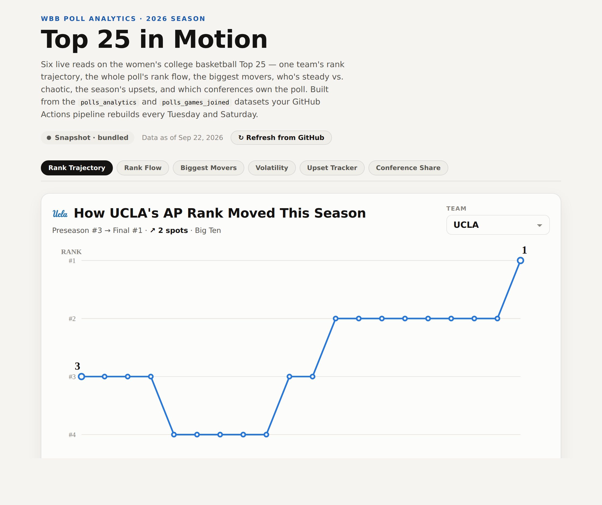
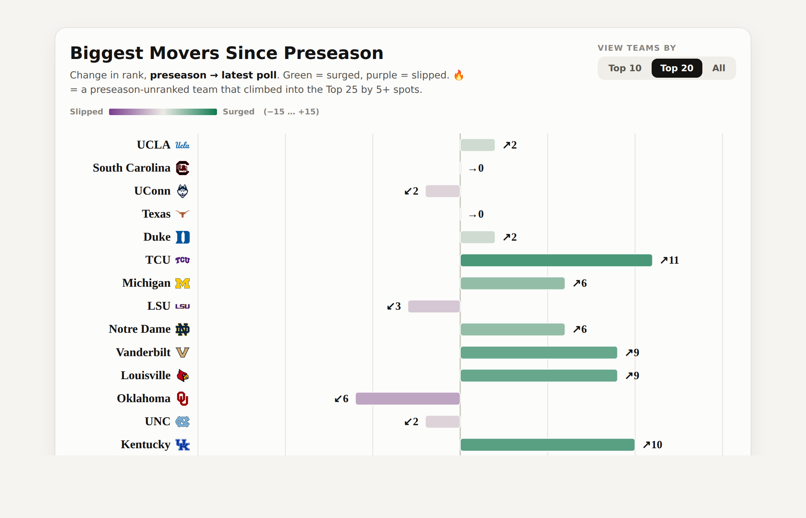
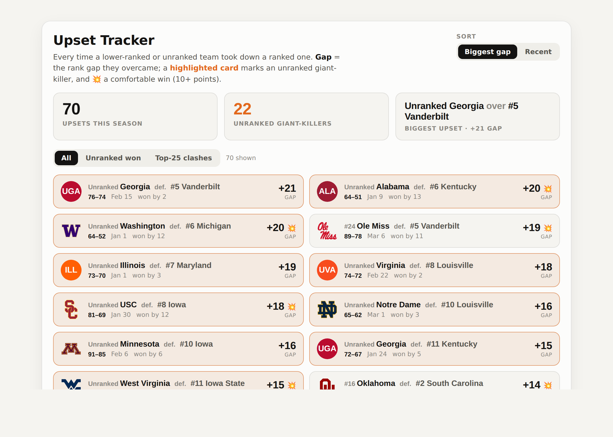

# wbb_polls_pbp_2026

🏀 Repository to collect women's basketball polls and play-by-play data for 2026.
Fetching NCAA D1 WBB polls &amp; standings (SportsReference) + schedule, box scores, pbp data (SportsDataVerse). Auto runs every Tues &amp; Sat AM for the 2025-2026 season.

## 🏀 Live Dashboard — Top 25 in Motion

An interactive dashboard of the AP Top 25 — **rank trajectories, poll rank flow, biggest movers, volatility, upsets, and conference share**. It reads this repo's `polls_analytics.csv` and `polls_games_joined.csv` **live from `main`**, so it refreshes on its own with every Tuesday/Saturday scrape — no rebuild or manual export.

**▶ Open the live dashboard → https://kbsmd-sportsmusicdata.github.io/wbb_polls_pbp_2026/**

*One team's AP rank, week by week — with a sticky chapter nav across all six visuals.*

*Biggest risers and fallers since preseason, on a diverging surged↔slipped scale.*

*Every giant-killing, read two ways: the rank gap overcome and the margin of victory.*

> A browser-native companion to the Tableau work — the same pipeline data, refreshing itself each week. The page source lives in [`docs/index.html`](docs/index.html) and is served by GitHub Pages from `main` / `/docs`.

## Structure
- `data/` — raw and processed datasets
- `scripts/` — data collection and processing scripts
- `docs/` — the live dashboard (`index.html`) and project notes
- `README.md` — this file

### Future projects using this repository include:

📈 **WBB D1 Rankings: A Four Factors Analysis of the Top 25**
- Phase 1: 2025-2026 current season analysis
- Phase 2: historical analysis, approx seasons 2000-2021 through 2025-2026 season
  - exploratory data analysis
  - predictive modeling

📊 **WBB D1 Team Styles Dashboard**

  
### License
This repository is released under the MIT License. See `LICENSE`
